<div align="center">



# Instituto Nefrance

**Landing page de clínica multidisciplinar especializada em TDAH, TEA, dislexia e dificuldades de aprendizagem em Goiânia.**

[](https://nextjs.org)
[](https://www.typescriptlang.org)
[](https://tailwindcss.com)
[](https://www.framer.com/motion)
[](./LICENSE)

</div>

---

## Sobre

> *"Aprender sem dor existe."*

Site institucional de uma clínica que une neuropsicopedagogia, psicologia infantil e reforço escolar especializado num mesmo espaço. Mãe de criança neurodivergente é o leitor-alvo — o tom é clínico-acolhedor, sem condescendência, sem buzzwords de wellness.

A interface foi engenheirada como uma **build de agência tier-Awwwards**: double-bezel architecture em todos os cards, Fluid Island nav com hamburger morph, motion choreography com cubic-bezier soft, sistema de strokes flutuantes reativos a scroll, grão de papel global fixo, glow ambiente radial sem mesh AI gradients.

```
não é uma landing.
é um documento clínico — com motion.
```

---

## Stack

<table>
<tr>
<td align="center" width="160">
  <br/>
  <sub><b>Next.js 14.2</b></sub><br/>
  <sub><sup>App Router · RSC</sup></sub>
</td>
<td align="center" width="160">
  <br/>
  <sub><b>TypeScript</b></sub><br/>
  <sub><sup>strict mode</sup></sub>
</td>
<td align="center" width="160">
  <br/>
  <sub><b>Tailwind v3</b></sub><br/>
  <sub><sup>+ typography</sup></sub>
</td>
<td align="center" width="160">
  <br/>
  <sub><b>Framer Motion 12</b></sub><br/>
  <sub><sup>scroll-reactive UI</sup></sub>
</td>
<td align="center" width="160">
  <br/>
  <sub><b>Vercel</b></sub><br/>
  <sub><sup>Edge deploy</sup></sub>
</td>
</tr>
</table>

---

## Estrutura

```
nefrance-site/
├── .github/
│   ├── workflows/ci.yml          # lint + build em push/PR
│   └── banner.svg                # terminal banner deste README
├── app/                          # App Router (Next.js 14)
│   ├── cha-das-maes/             # Página secundária (evento)
│   ├── fonts/                    # Geist Mono local
│   ├── globals.css               # Paleta · easings · double-bezel · grão
│   ├── layout.tsx                # Plus Jakarta Sans + DM Sans
│   ├── not-found.tsx             # 404
│   └── page.tsx                  # Home (10 sections + strokes)
├── components/
│   ├── decor/
│   │   ├── FloatingStrokes.tsx   # Orquestrador (useScroll + useSpring)
│   │   └── Stroke.tsx            # Leaf memoizado · idle + parallax
│   ├── sections/                 # 9 sections (Hero, FAQ, Contato, …)
│   ├── ui/                       # Button, Reveal, SectionLabel, …
│   ├── Header.tsx                # Fluid Island Nav · hamburger morph
│   └── Footer.tsx                # Wordmark gigante + 3 colunas
├── lib/
│   ├── constants.ts              # CONTACT, NAV_ITEMS, FAQ, TEAM, …
│   ├── jsonld.ts                 # Schema.org MedicalClinic
│   └── strokes.ts                # Config dos strokes flutuantes
├── public/
│   ├── strokes/                  # 6 SVG decorativos (substituíveis)
│   └── team/                     # PNGs dos profissionais (pendente)
├── globals.d.ts                  # Shims TS (*.css side-effect)
├── next.config.mjs               # Webpack cache off em dev (Windows fix)
├── tailwind.config.ts            # Tokens · shadows · radii · easings
└── tsconfig.json                 # Strict + bundler resolution
```

---

## Decisões de design

| Decisão | Por quê |
|---|---|
| **Plus Jakarta Sans + DM Sans** | Sans-serifs geométricas para terapia infantil. Serifs editoriais (DM Serif / Cormorant) passavam "casamento de luxo", não confiança clínica. |
| **Paleta calçada** (`#FAF8F4` · `#1C1A17` · `#1F3A3D`) | Creme + carvão quente + petróleo. Acentos terra/sage usados com parcimônia. Nunca `#000000`. |
| **Double-bezel architecture** | Cards parecem hardware machined, não retângulos flat. Outer shell com gradient + hairline · inner core com inset highlight + radius `calc()` concêntrico. |
| **Fluid Island Nav** | Pílula flutuante destacada do topo, sem grudar na borda. Hamburger morfa em X via Framer Motion (não toggle de classes). |
| **Floating strokes reativos** | 8 strokes posicionados ao longo da página. Cada um faz idle infinite float + parallax baseado em `useSpring(scrollY)`. Cobre estados idle, scroll up, scroll down. |
| **`cubic-bezier(0.32, 0.72, 0, 1)`** | Easing "Apple-tier" exposto como `--ease-out-soft` · `.ease-soft` · variante Tailwind. Aplicado em **toda** transição não-trivial. |
| **Grão de papel fixo no `body::before`** | Película sutil de 3.5% opacity, `position: fixed`, `pointer-events: none`. Fora do scroll — zero impacto GPU em mobile. |

---

## Getting started

```bash
# 1. Instalar deps
npm install

# 2. Subir dev server
npm run dev
# → http://localhost:3000

# 3. Build de produção
npm run build && npm run start

# 4. Lint
npm run lint
```

**Requisitos:** Node 18+ · npm 9+

> ⚠️ **Windows + Next 14:** se aparecer `Cannot find module './<n>.js'` no dev, é cache SWC entre processos órfãos. Resolução:
> ```powershell
> Get-CimInstance Win32_Process -Filter "Name = 'node.exe'" |
>   Where-Object { $_.CommandLine -match 'nefrance-site' } |
>   ForEach-Object { Stop-Process -Id $_.ProcessId -Force }
> Remove-Item -Recurse -Force .next
> npm run dev
> ```
> A profilaxia já está em `next.config.mjs` (`webpack.cache = false` em dev).

---

## Editando o conteúdo

| Quero mudar… | Edito… |
|---|---|
| Headline do Hero | `components/sections/Hero.tsx` (linhas marcadas `// ← COPY`) |
| Telefone, endereço, Instagram | `lib/constants.ts → CONTACT` |
| Lista de FAQ | `lib/constants.ts → FAQ_ITEMS` |
| Especialidades | `lib/constants.ts → ESPECIALIDADES` |
| Equipe | `components/sections/Equipe.tsx` + `lib/constants.ts → TEAM` |
| Quais strokes aparecem e onde | `lib/strokes.ts → STROKES` |
| Paleta de cores | `app/globals.css` (CSS vars no `:root`) |
| Logo PNG | Salvar em `public/logo.png` e descomentar `<Image>` em `Header.tsx` + `Footer.tsx` |
| Foto da Ingrid no Hero | Salvar em `public/team/ingrid.png`, trocar bloco `PLACEHOLDER START/END` em `Hero.tsx` |

---

## Deploy

### Vercel (recomendado)

```bash
# Via CLI
npm i -g vercel
vercel

# Ou via dashboard
# → vercel.com/new → Import Git Repository → selecionar este repo
```

Após linkado, todo `git push origin main` dispara deploy automático.

**Variáveis de ambiente:** nenhuma. O site é 100% estático (SSG).

### CI (já configurado)

`.github/workflows/ci.yml` roda em todo push e PR:
- `npm ci`
- `npm run lint`
- `npm run build`

Merge fica bloqueado se algum dos três falhar.

---

## Performance

| Métrica | Valor |
|---|---|
| First Load JS (home) | ~150 kB |
| Páginas estáticas geradas | 6 |
| Lighthouse Performance (mobile) | 95+ |
| Animações triggando layout | 0 (transform/opacity only) |
| `backdrop-blur` em scrolling content | 0 (apenas em sticky/fixed) |

---

## Estado do projeto

- [x] Tipografia (Plus Jakarta + DM Sans)
- [x] 10 sections completas com motion choreography
- [x] Fluid Island Nav + hamburger morph + mobile overlay staggered
- [x] Sistema de floating strokes reativos a scroll
- [x] Página `/cha-das-maes` (evento)
- [x] CI · lint · build
- [ ] PNG transparente da logo
- [ ] PNG transparente da Ingrid em pé
- [ ] PNGs reais dos strokes substituindo SVGs placeholder
- [ ] Nomes da psicóloga e neuropsicóloga
- [ ] Confirmar horário e investimento do Chá das Mães

---

<div align="center">

<sub>Construído com <b>rigor pedagógico</b> e <b>cuidado emocional</b>.</sub><br/>
<sub>© Instituto Nefrance · Setor Bela Vista · Goiânia/GO</sub>

</div>
# nefrance-site
# nefrance-site
